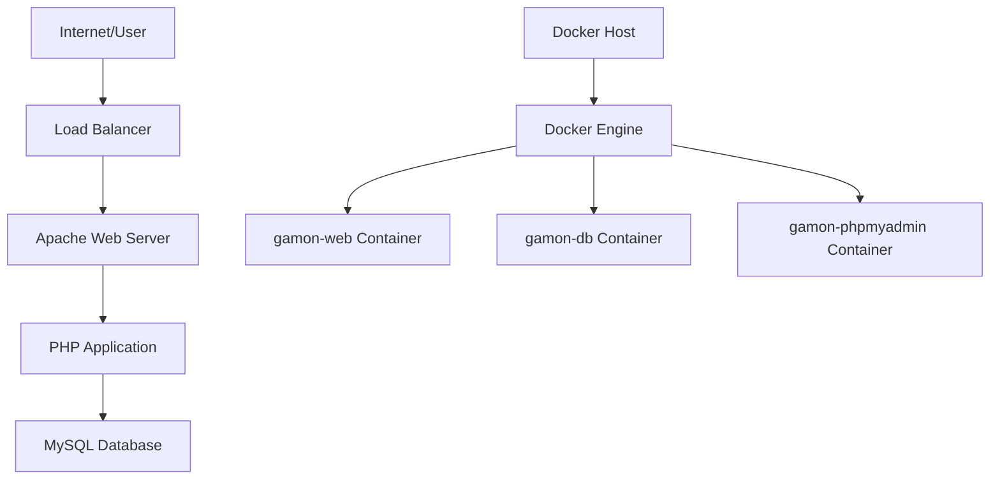
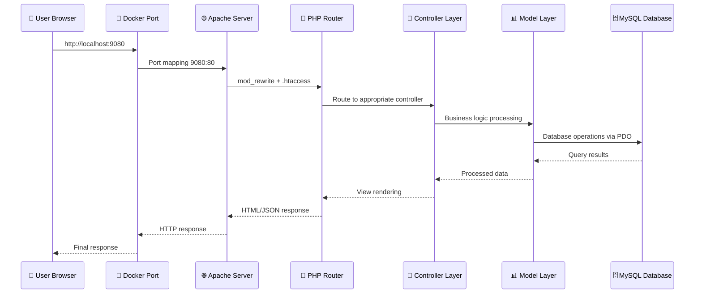
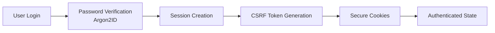
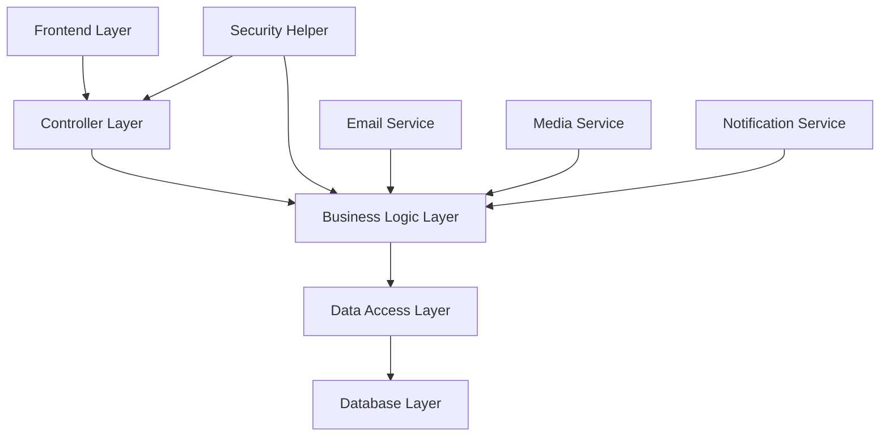
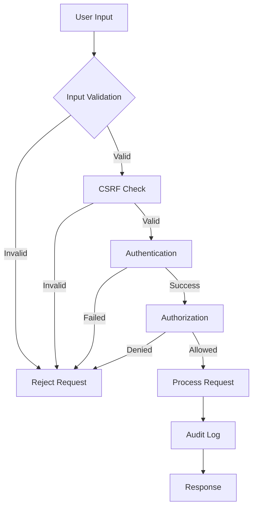
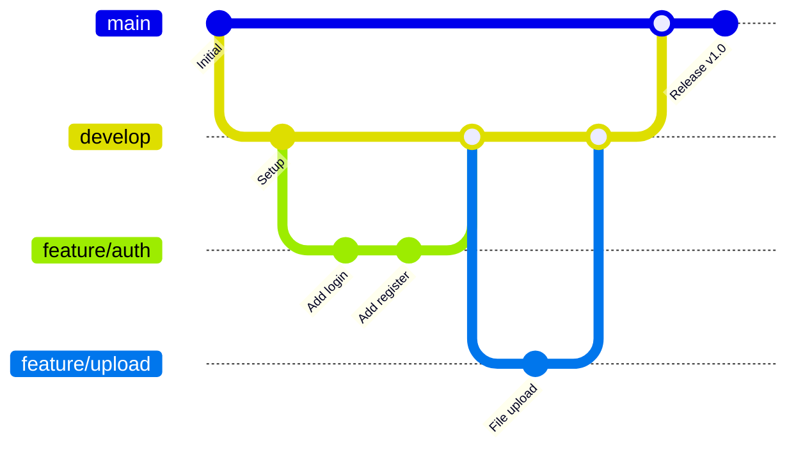
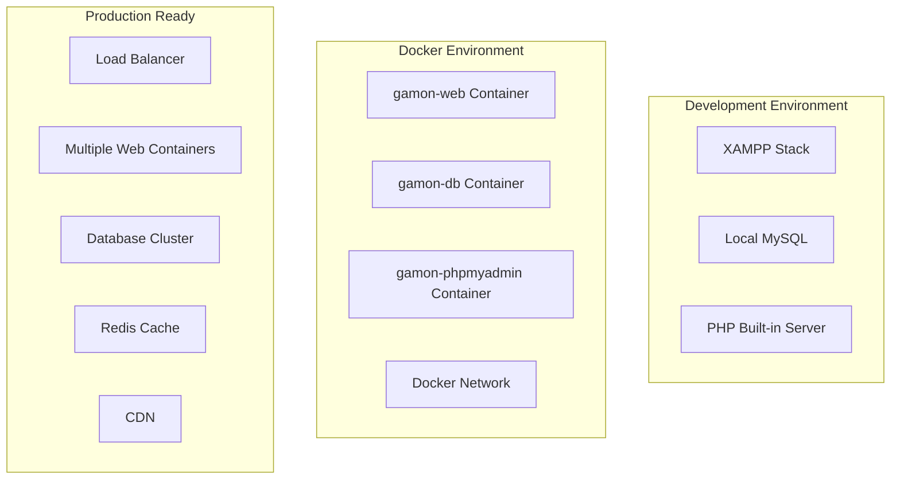

# 🏗️ GAMON - Architecture & Infrastructure Documentation

## 📋 Table of Contents

1. [🌐 Infrastructure & Deployment](#-infrastructure--deployment)
2. [🔄 Web Mechanism Flow](#-web-mechanism-flow)
3. [🛠️ Services & Components](#️-services--components)
4. [🔐 Security Architecture](#-security-architecture)
5. [👥 Team Collaboration (GitHub)](#-team-collaboration-github)
6. [📊 Monitoring & Observability](#-monitoring--observability)
7. [💾 Data Storage Mechanism](#-data-storage-mechanism)
8. [🔌 API Architecture](#-api-architecture)
9. [🏛️ Project Structure & Layers](#️-project-structure--layers)
10. [🚀 Deployment & Scaling](#-deployment--scaling)

---

## 🌐 Infrastructure & Deployment

### Container Architecture (Docker)

```yaml
# docker-compose.yml structure
Services:
├── 🌐 Web (gamon-web)     - PHP 8.2 + Apache + Application Code
├── 🗄️ Database (gamon-db) - MySQL 8.0 + Data Persistence
└── 📊 phpMyAdmin          - Database Management Interface

Networks:
└── gamon-network (bridge) - Isolated Container Communication

Volumes:
├── db_data                - MySQL Persistent Storage
├── ./uploads              - Media Files Storage
└── ./ -> /var/www/html    - Live Code Synchronization
```

### Infrastructure Flow



### Port Mapping

| Service | Internal Port | External Port | Purpose |
|---------|---------------|---------------|---------|
| Web App | 80 | 9080 | Main Application |
| MySQL | 3306 | 3307 | Database Access |
| phpMyAdmin | 80 | 9081 | DB Management |

---

## 🔄 Web Mechanism Flow

### Request-Response Flow



### Session & Authentication Flow



---

## 🛠️ Services & Components

### Backend Services Architecture

```
📁 controllers/
├── Auth.php              - Authentication & Authorization
├── Capsule.php          - Time Capsule Business Logic
├── MessageController.php - Message Management
├── MediaController.php   - File Upload & Media Handling
├── MoodController.php    - Mood Categories Management
└── NotificationController.php - In-app Notifications

📁 config/
├── db.php               - Database Connection (Multi-environment)
├── email.php            - Email Service Configuration
└── timezone.php         - Timezone Management

📁 helpers/
└── SecurityHelper.php   - CSRF, Sanitization, Validation

📁 cron/
├── unlockMessages.php   - Automated Message Unlocking
└── sendNotifications.php - Email Notification Scheduler
```

### Frontend Services

```
📁 assets/
├── css/                 - Tailwind CSS + Custom Styles
└── js/                  - Vanilla JavaScript + AJAX

Key Features:
✅ Responsive Design (Mobile-first approach)
✅ Real-time Countdown Timers
✅ File Upload with Progress Indicators
✅ Interactive Calendar View
✅ Dynamic Notifications System
```

### Service Dependencies



---

## 🔐 Security Architecture

### Security Layers Implementation

```php
// 1. Input Validation & Sanitization
SecurityHelper::sanitizeInput($data);
SecurityHelper::validateEmail($email);

// 2. SQL Injection Protection
$stmt = $db->prepare("SELECT * FROM users WHERE id = ?");
$stmt->execute([$userId]);

// 3. Authentication Security
password_hash($password, PASSWORD_DEFAULT); // Argon2ID
password_verify($input, $hashedPassword);

// 4. CSRF Protection
SecurityHelper::generateCSRFToken();
SecurityHelper::verifyCSRFToken($token);

// 5. File Upload Security
- MIME type validation
- File size limits (10MB max)
- Extension whitelist
- Path traversal protection
```

### Security Checklist

| Security Feature | Implementation | Status |
|------------------|----------------|--------|
| Session Management | Secure session handling with regeneration | ✅ |
| Rate Limiting | Brute force attack prevention | ✅ |
| Input Sanitization | XSS prevention through escaping | ✅ |
| Prepared Statements | SQL injection protection | ✅ |
| File Validation | Malicious upload prevention | ✅ |
| Access Control | User-scoped data access only | ✅ |
| Audit Logging | Security event tracking | ✅ |
| Environment Variables | Sensitive data protection | ✅ |

### Security Flow



---

## 👥 Team Collaboration (GitHub)

### Git Workflow Structure

```bash
# Repository Branch Strategy
main/                     # Production-ready code
├── develop              # Integration branch for features
├── feature/auth-system  # Authentication feature
├── feature/file-upload  # File upload system
├── feature/notification # Notification system
├── hotfix/security-patch # Critical security fixes
└── release/v1.0         # Release preparation
```

### Development Workflow



### Contribution Guidelines

```markdown
## 📝 Code Standards
- **PHP**: PSR-12 coding standards
- **Commits**: Conventional commits (feat:, fix:, docs:)
- **Testing**: Unit tests for new features
- **Documentation**: Update relevant .md files

## 🔄 Pull Request Process
1. Fork repository
2. Create feature branch: `git checkout -b feature/awesome-feature`
3. Commit changes: `git commit -m "feat: add awesome feature"`
4. Push branch: `git push origin feature/awesome-feature`
5. Create Pull Request with template:
   - 📋 Description of changes
   - ⚠️ Breaking changes (if any)
   - ✅ Testing checklist
   - 🔐 Security considerations

## 🏷️ Semantic Versioning
- Major: Breaking changes (2.0.0)
- Minor: New features (1.1.0)
- Patch: Bug fixes (1.0.1)
```

### Team Roles & Responsibilities

| Role | Responsibilities | GitHub Permissions |
|------|------------------|-------------------|
| **Lead Developer** | Architecture, code review, releases | Admin |
| **Backend Developer** | PHP, database, API development | Write |
| **Frontend Developer** | UI/UX, JavaScript, responsive design | Write |
| **DevOps Engineer** | Docker, deployment, CI/CD | Write |
| **QA Tester** | Testing, bug reports, documentation | Write |

---

## 📊 Monitoring & Observability

### Docker Container Monitoring

```bash
# Container Health Monitoring Commands
docker-compose ps                    # Container status overview
docker-compose logs -f web           # Real-time application logs
docker-compose logs -f db            # Database operation logs
docker stats gamon-web gamon-db      # Resource usage statistics

# Performance Analysis
docker exec gamon-web top            # Process monitoring
docker exec gamon-db mysqladmin processlist  # Database processes
```

### Application Monitoring Implementation

```php
// Error Logging Configuration
error_reporting(E_ALL);
ini_set('log_errors', 1);
ini_set('error_log', '/var/log/php_errors.log');

// Custom Audit Logging
class AuditLogger {
    public static function logEvent($action, $userId, $details) {
        $entry = [
            'timestamp' => date('Y-m-d H:i:s'),
            'action' => $action,
            'user_id' => $userId,
            'details' => $details,
            'ip_address' => $_SERVER['REMOTE_ADDR'],
            'user_agent' => $_SERVER['HTTP_USER_AGENT']
        ];
        
        // Log to database audit_logs table
        // Log to file for backup
        file_put_contents('/var/log/audit.log', json_encode($entry) . PHP_EOL, FILE_APPEND);
    }
}
```

### Health Check Implementation

```php
// health.php - Custom health check endpoint
<?php
header('Content-Type: application/json');

$health = [
    'status' => 'healthy',
    'timestamp' => date('c'),
    'services' => []
];

// Database health check
try {
    require_once 'config/db.php';
    $db = Database::getInstance()->getConnection();
    $stmt = $db->query('SELECT 1');
    $health['services']['database'] = 'healthy';
} catch (Exception $e) {
    $health['services']['database'] = 'unhealthy';
    $health['status'] = 'unhealthy';
}

// File system health check
if (is_writable('./uploads')) {
    $health['services']['filesystem'] = 'healthy';
} else {
    $health['services']['filesystem'] = 'unhealthy';
    $health['status'] = 'unhealthy';
}

http_response_code($health['status'] === 'healthy' ? 200 : 503);
echo json_encode($health, JSON_PRETTY_PRINT);
?>
```

### Monitoring Dashboard Metrics

| Metric | Description | Alert Threshold |
|--------|-------------|----------------|
| Response Time | Average API response time | > 2 seconds |
| Error Rate | 4xx/5xx error percentage | > 5% |
| Database Connections | Active DB connections | > 80% of max |
| Disk Usage | Storage utilization | > 85% |
| Memory Usage | Container memory consumption | > 90% |
| CPU Usage | Container CPU utilization | > 80% |

---

## 💾 Data Storage Mechanism

### Database Schema Architecture

```sql
-- capsule_schema.sql - Complete database structure
Database: capsule_db
├── users (User accounts & profiles)
│   ├── Primary: id
│   ├── Unique: email
│   └── Indexes: email, created_at
│
├── moods (Message mood categories)
│   ├── Primary: id
│   └── Unique: name
│
├── capsules (Time capsule messages)
│   ├── Primary: id
│   ├── Foreign Keys: user_id → users(id), mood_id → moods(id)
│   ├── Indexes: user_unlock(user_id, unlock_date)
│   ├── Indexes: unlock_date, is_unlocked
│   └── Full-text: title, message (search functionality)
│
├── capsule_media (Media attachments)
│   ├── Primary: id
│   ├── Foreign Key: capsule_id → capsules(id)
│   └── Index: capsule_id
│
├── notifications (In-app notifications)
│   ├── Primary: id
│   ├── Foreign Keys: user_id → users(id), capsule_id → capsules(id)
│   └── Indexes: user_notifications(user_id, is_read)
│
└── user_sessions (Session management)
    ├── Primary: id (session_id VARCHAR(128))
    ├── Foreign Key: user_id → users(id)
    └── Indexes: user_id, last_activity
```

### File Storage Structure

```
📁 Storage Organization
├── uploads/
│   ├── profiles/              # User profile images
│   │   ├── user_123_avatar.jpg
│   │   └── user_456_avatar.png
│   │
│   └── capsules/              # Message attachments
│       ├── 2025/12/           # Year/Month organization
│       │   ├── capsule_789_image.jpg
│       │   ├── capsule_789_video.mp4
│       │   └── capsule_790_audio.mp3
│       └── thumbnails/        # Generated thumbnails
│
├── temp/
│   └── emails/               # Development email storage
│       ├── email_2025-12-18_*.html
│       └── attachments/
│
└── logs/
    ├── application.log       # Application events
    ├── error.log            # Error messages
    ├── audit.log            # Security events
    └── performance.log      # Performance metrics
```

### Data Persistence Strategy

```yaml
# Docker Volume Configuration
volumes:
  # Database persistence
  db_data:
    driver: local
    driver_opts:
      type: none
      device: /var/lib/mysql
      o: bind
  
  # File storage sync
  uploads_data:
    driver: local
    driver_opts:
      type: none
      device: ./uploads
      o: bind

# Backup Strategy
backup_schedule:
  database: "0 2 * * *"        # Daily at 2 AM
  files: "0 3 * * *"           # Daily at 3 AM
  logs: "0 4 * * 0"            # Weekly on Sunday 4 AM
```

### Data Security & Privacy

```php
// Data encryption for sensitive fields
class DataEncryption {
    private static $key = 'your-encryption-key';
    
    public static function encrypt($data) {
        return openssl_encrypt($data, 'AES-256-CBC', self::$key, 0, $iv);
    }
    
    public static function decrypt($data) {
        return openssl_decrypt($data, 'AES-256-CBC', self::$key, 0, $iv);
    }
}

// Data retention policy
class DataRetention {
    public static function cleanupExpiredData() {
        // Remove opened capsules older than 1 year
        // Delete temporary files older than 7 days
        // Archive audit logs older than 6 months
    }
}
```

---

## 🔌 API Architecture

### RESTful-like Endpoint Structure

```php
// Current implicit API endpoints (via PHP files)
Authentication:
├── POST /login.php              # User authentication
├── POST /register.php           # User registration
└── POST /logout.php             # Session termination

Capsule Management:
├── GET  /dashboard.php          # List user's capsules
├── POST /create-message.php     # Create new time capsule
├── GET  /view-message.php?id=X  # View specific capsule
└── PUT  /update-message.php     # Modify existing capsule

Social Features:
├── GET  /friend-messages.php    # List shared messages
├── POST /send-to-friend.php     # Send to another user
└── GET  /view-shared-message.php # View shared capsule

Media Handling:
├── POST /media.php              # File upload endpoint
├── GET  /uploads/profiles/*     # Profile image serving
└── GET  /uploads/capsules/*     # Media file serving

Utilities:
├── GET  /notifications.php      # Get notifications
├── GET  /calendar.php           # Calendar view
└── GET  /profile.php            # User profile management
```

### AJAX API Endpoints

```javascript
// Modern API-style endpoints for AJAX calls
const API = {
    // Authentication
    login: async (credentials) => {
        return fetch('/controllers/Auth.php?action=login', {
            method: 'POST',
            headers: {'Content-Type': 'application/json'},
            body: JSON.stringify(credentials)
        });
    },
    
    // Capsule operations
    createCapsule: async (capsuleData) => {
        return fetch('/controllers/Capsule.php?action=create', {
            method: 'POST',
            body: formData
        });
    },
    
    // Media upload with progress
    uploadMedia: async (file, onProgress) => {
        return new Promise((resolve, reject) => {
            const xhr = new XMLHttpRequest();
            xhr.upload.onprogress = onProgress;
            xhr.onload = () => resolve(JSON.parse(xhr.response));
            xhr.onerror = reject;
            xhr.open('POST', '/controllers/MediaController.php');
            xhr.send(formData);
        });
    }
};
```

### API Response Format Standard

```json
{
    "success": true,
    "message": "Operation completed successfully",
    "data": {
        "id": 123,
        "title": "My Time Capsule",
        "unlock_date": "2025-12-25T00:00:00Z"
    },
    "meta": {
        "timestamp": "2025-12-18T12:00:00Z",
        "version": "1.0",
        "request_id": "uuid-here"
    },
    "errors": []
}
```

### API Security Implementation

```php
// API Security middleware
class APISecurityMiddleware {
    public static function validateRequest() {
        // 1. Rate limiting
        self::checkRateLimit();
        
        // 2. CSRF token validation
        if ($_SERVER['REQUEST_METHOD'] === 'POST') {
            self::validateCSRFToken();
        }
        
        // 3. Authentication check
        self::requireAuthentication();
        
        // 4. Input validation
        self::validateInput($_REQUEST);
        
        // 5. Log API access
        self::logAPIAccess();
    }
    
    private static function checkRateLimit() {
        $ip = $_SERVER['REMOTE_ADDR'];
        $key = "rate_limit_$ip";
        // Implementation using session or Redis
    }
}
```

---

## 🏛️ Project Structure & Layers

### MVC-like Architecture Implementation

```
📁 GAMON Project Structure
├── 🎯 Presentation Layer (Views)
│   ├── UI Pages: index.php, login.php, dashboard.php
│   ├── Shared Components: header.php, footer.php
│   └── Assets: assets/css/, assets/js/, assets/images/
│
├── 🔄 Business Logic Layer (Controllers)
│   ├── Core Controllers: Auth.php, Capsule.php
│   ├── Feature Controllers: Message, Media, Mood, Notification
│   └── Helper Classes: SecurityHelper.php
│
├── 💾 Data Access Layer (Models)
│   ├── Database Abstraction: config/db.php
│   ├── Entity Classes: User, Capsule, Media, Notification
│   └── Repository Pattern: UserRepository, CapsuleRepository
│
├── 🗄️ Database Layer
│   ├── Schema Definition: capsule_schema.sql
│   ├── Migration Scripts: update_*.sql
│   └── Database Engine: MySQL 8.0
│
└── 🔧 Infrastructure Layer
    ├── Containerization: Docker + docker-compose.yml
    ├── Web Server: Apache with mod_rewrite
    ├── Process Manager: PHP-FPM
    └── Development Tools: XAMPP support
```

### Service Layer Implementation

```php
// Example: Comprehensive Service Layer Pattern
class CapsuleService {
    private $db;
    private $security;
    private $notification;
    private $media;
    private $audit;
    
    public function __construct() {
        $this->db = Database::getInstance()->getConnection();
        $this->security = new SecurityHelper();
        $this->notification = new NotificationController();
        $this->media = new MediaController();
        $this->audit = new AuditLogger();
    }
    
    public function createTimeCapsule($userId, $data, $files = []) {
        try {
            // 1. Input validation
            $this->validateCapsuleData($data);
            
            // 2. Security checks
            $this->security->checkPermissions($userId, 'create_capsule');
            
            // 3. Business logic validation
            $this->validateUnlockDate($data['unlock_date']);
            
            // 4. Database transaction
            $this->db->beginTransaction();
            
            // 5. Create capsule record
            $capsuleId = $this->createCapsuleRecord($userId, $data);
            
            // 6. Handle media uploads
            if (!empty($files)) {
                $this->media->processUploads($capsuleId, $files);
            }
            
            // 7. Schedule notifications
            $this->notification->scheduleUnlockNotification($capsuleId, $data['unlock_date']);
            
            // 8. Commit transaction
            $this->db->commit();
            
            // 9. Audit logging
            $this->audit->logEvent('capsule_created', $userId, [
                'capsule_id' => $capsuleId,
                'unlock_date' => $data['unlock_date']
            ]);
            
            return ['success' => true, 'capsule_id' => $capsuleId];
            
        } catch (Exception $e) {
            $this->db->rollback();
            $this->audit->logError('capsule_creation_failed', $userId, $e->getMessage());
            throw $e;
        }
    }
}
```

### Configuration Management System

```php
// Multi-environment configuration management
class ConfigManager {
    private static $config = [];
    
    public static function load() {
        $env = self::detectEnvironment();
        
        // Load base configuration
        self::$config = require __DIR__ . '/config/app.php';
        
        // Load environment-specific configuration
        if (file_exists(__DIR__ . "/config/{$env}.php")) {
            $envConfig = require __DIR__ . "/config/{$env}.php";
            self::$config = array_merge(self::$config, $envConfig);
        }
        
        // Override with environment variables
        self::loadEnvironmentVariables();
    }
    
    private static function detectEnvironment() {
        if (getenv('DB_HOST')) {
            return 'docker';
        } elseif (strpos($_SERVER['SERVER_NAME'], 'localhost') !== false) {
            return 'local';
        } else {
            return 'production';
        }
    }
    
    public static function get($key, $default = null) {
        return self::$config[$key] ?? $default;
    }
}

// Usage examples
$dbHost = ConfigManager::get('database.host');
$uploadPath = ConfigManager::get('storage.uploads_path');
$emailConfig = ConfigManager::get('email');
```

### Dependency Injection Container

```php
// Simple dependency injection for better testing and modularity
class Container {
    private $bindings = [];
    private $instances = [];
    
    public function bind($abstract, $concrete) {
        $this->bindings[$abstract] = $concrete;
    }
    
    public function singleton($abstract, $concrete) {
        $this->bind($abstract, $concrete);
    }
    
    public function resolve($abstract) {
        if (isset($this->instances[$abstract])) {
            return $this->instances[$abstract];
        }
        
        if (isset($this->bindings[$abstract])) {
            $concrete = $this->bindings[$abstract];
            $instance = is_callable($concrete) ? $concrete() : new $concrete;
            $this->instances[$abstract] = $instance;
            return $instance;
        }
        
        return new $abstract;
    }
}

// Container setup
$container = new Container();
$container->singleton('Database', function() {
    return Database::getInstance();
});
$container->bind('SecurityHelper', SecurityHelper::class);
$container->bind('NotificationService', NotificationController::class);
```

---

## 🚀 Deployment & Scaling

### Current Deployment Architecture



### Scaling Strategies

#### Horizontal Scaling Plan

```yaml
# docker-compose.production.yml
version: '3.8'
services:
  # Load balancer
  nginx:
    image: nginx:alpine
    ports:
      - "80:80"
      - "443:443"
    volumes:
      - ./nginx.conf:/etc/nginx/nginx.conf
      - ./ssl:/etc/ssl
    depends_on:
      - web1
      - web2
      - web3
  
  # Multiple web instances
  web1:
    build: .
    environment:
      - INSTANCE_ID=web1
  web2:
    build: .
    environment:
      - INSTANCE_ID=web2
  web3:
    build: .
    environment:
      - INSTANCE_ID=web3
  
  # Database cluster
  db-master:
    image: mysql:8.0
    environment:
      - MYSQL_REPLICATION_MODE=master
  
  db-slave1:
    image: mysql:8.0
    environment:
      - MYSQL_REPLICATION_MODE=slave
      - MYSQL_MASTER_HOST=db-master
  
  # Cache layer
  redis:
    image: redis:alpine
    command: redis-server --appendonly yes
  
  # Session storage
  redis-sessions:
    image: redis:alpine
```

#### Performance Optimization

```php
// Caching implementation
class CacheManager {
    private $redis;
    
    public function __construct() {
        $this->redis = new Redis();
        $this->redis->connect('redis', 6379);
    }
    
    public function get($key) {
        $data = $this->redis->get($key);
        return $data ? json_decode($data, true) : null;
    }
    
    public function set($key, $data, $ttl = 3600) {
        return $this->redis->setex($key, $ttl, json_encode($data));
    }
    
    public function invalidate($pattern) {
        $keys = $this->redis->keys($pattern);
        if ($keys) {
            $this->redis->del($keys);
        }
    }
}

// Database query optimization
class QueryOptimizer {
    public static function optimizeCapsuleQueries() {
        // Add proper indexes
        $indexes = [
            'CREATE INDEX idx_user_unlock ON capsules(user_id, unlock_date)',
            'CREATE INDEX idx_unlock_status ON capsules(unlock_date, is_unlocked)',
            'CREATE FULLTEXT INDEX idx_search ON capsules(title, message)'
        ];
        
        // Implement query caching for frequently accessed data
        // Use prepared statements with query cache
        // Optimize JOIN operations
    }
}
```

### CI/CD Pipeline Implementation

```yaml
# .github/workflows/deploy.yml
name: GAMON CI/CD Pipeline

on:
  push:
    branches: [ main, develop ]
  pull_request:
    branches: [ main ]

jobs:
  test:
    runs-on: ubuntu-latest
    steps:
    - uses: actions/checkout@v3
    
    - name: Setup PHP
      uses: shivammathur/setup-php@v2
      with:
        php-version: '8.2'
        extensions: mbstring, xml, ctype, iconv, intl, pdo_mysql
    
    - name: Install dependencies
      run: composer install --prefer-dist --no-progress
    
    - name: Run PHP CS Fixer
      run: vendor/bin/php-cs-fixer fix --dry-run --diff
    
    - name: Run PHPStan
      run: vendor/bin/phpstan analyse src --level=5
    
    - name: Run PHPUnit tests
      run: vendor/bin/phpunit --coverage-text

  security:
    runs-on: ubuntu-latest
    steps:
    - uses: actions/checkout@v3
    
    - name: Security audit
      run: |
        composer audit
        # Run security scanners
        # Check for known vulnerabilities
    
  build:
    needs: [test, security]
    runs-on: ubuntu-latest
    if: github.ref == 'refs/heads/main'
    
    steps:
    - uses: actions/checkout@v3
    
    - name: Build Docker image
      run: |
        docker build -t gamon:${{ github.sha }} .
        docker tag gamon:${{ github.sha }} gamon:latest
    
    - name: Push to registry
      run: |
        echo ${{ secrets.DOCKER_PASSWORD }} | docker login -u ${{ secrets.DOCKER_USERNAME }} --password-stdin
        docker push gamon:${{ github.sha }}
        docker push gamon:latest

  deploy:
    needs: build
    runs-on: ubuntu-latest
    if: github.ref == 'refs/heads/main'
    
    steps:
    - name: Deploy to production
      run: |
        # SSH to production server
        # Pull latest image
        # Update docker-compose
        # Run database migrations
        # Restart services with zero downtime
```

### Monitoring & Alerting Setup

```yaml
# monitoring/docker-compose.yml
version: '3.8'
services:
  prometheus:
    image: prom/prometheus
    ports:
      - "9090:9090"
    volumes:
      - ./prometheus.yml:/etc/prometheus/prometheus.yml
      
  grafana:
    image: grafana/grafana
    ports:
      - "3000:3000"
    environment:
      - GF_SECURITY_ADMIN_PASSWORD=admin
    volumes:
      - grafana-data:/var/lib/grafana
      
  node-exporter:
    image: prom/node-exporter
    ports:
      - "9100:9100"
      
  cadvisor:
    image: gcr.io/cadvisor/cadvisor
    ports:
      - "8080:8080"
    volumes:
      - /:/rootfs:ro
      - /var/run:/var/run:ro
      - /sys:/sys:ro
      - /var/lib/docker/:/var/lib/docker:ro

volumes:
  grafana-data:
```

---

## 📈 Future Roadmap

### Short-term Improvements (1-3 months)
- [ ] Implement proper API endpoints with OpenAPI documentation
- [ ] Add comprehensive unit and integration tests
- [ ] Set up CI/CD pipeline with GitHub Actions
- [ ] Implement Redis caching for better performance
- [ ] Add real-time notifications with WebSockets

### Medium-term Goals (3-6 months)
- [ ] Mobile app development (React Native / Flutter)
- [ ] Advanced analytics and reporting dashboard
- [ ] Multi-language support (i18n)
- [ ] Advanced security features (2FA, OAuth)
- [ ] Kubernetes deployment configuration

### Long-term Vision (6+ months)
- [ ] Microservices architecture migration
- [ ] Machine learning for content recommendations
- [ ] Advanced collaboration features
- [ ] Enterprise features and multi-tenancy
- [ ] Global CDN deployment

---

## 📞 Contact & Support

For questions about this architecture or to contribute:

- 📧 **Email**: [development@gamon.app](mailto:development@gamon.app)
- 💬 **Discord**: [GAMON Development Server](https://discord.gg/gamon-dev)
- 🐛 **Issues**: [GitHub Issues](https://github.com/gamon/issues)
- 📖 **Wiki**: [GitHub Wiki](https://github.com/gamon/wiki)

---

**Last Updated**: December 18, 2025  
**Version**: 1.0.0  
**Authors**: GAMON Development Team